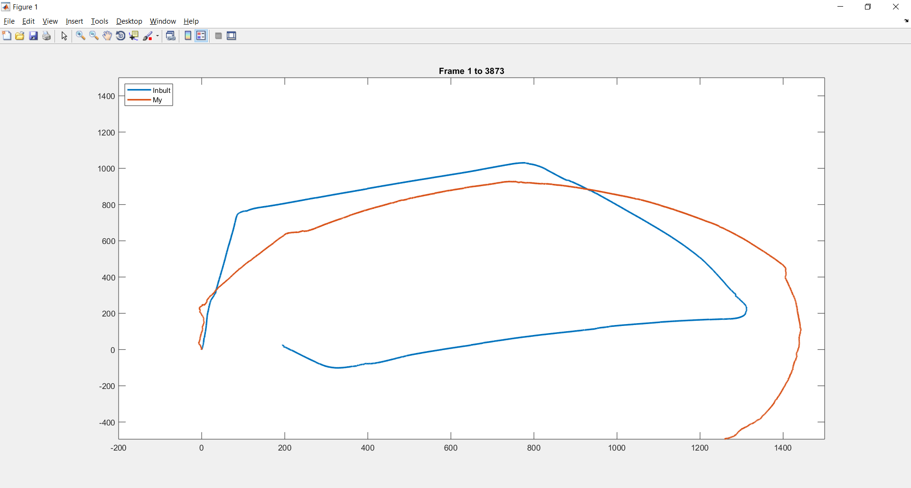

# Visual-Odometry
This repository explains the application of visual odometry method to get structure from motion. It comapres the result of written algorithm with the inbuilt function of MATLAB. 

The written algorithm doesn't produce exact structure from motion. 
The result comparision is below:

